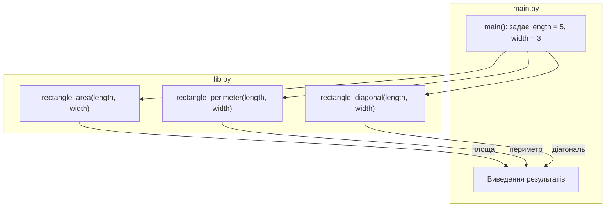

# Діаграма програми

```mermaid
flowchart TD
    subgraph Main["main.py"]
        M["main(): задає length = 5, width = 3"]
        O["Виведення результатів"]
    end

    subgraph Lib["lib.py"]
        A["rectangle_area(length, width)"]
        P["rectangle_perimeter(length, width)"]
        D["rectangle_diagonal(length, width)"]
    end

    M --> A
    M --> P
    M --> D
    A -->|площа| O
    P -->|периметр| O
    D -->|діагональ| O
```

Функція main() викликає три функції з lib.py та виводить отримані результати.
